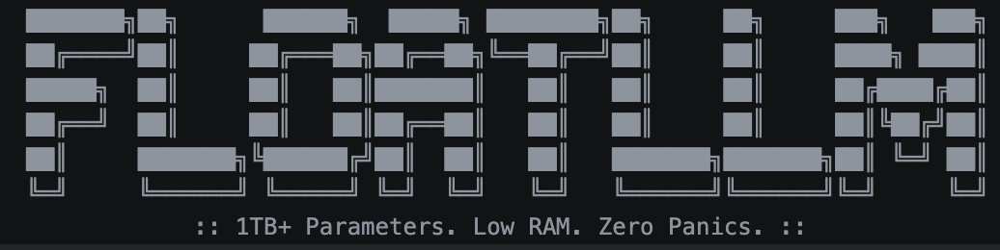

# FloatLLM 🚀

<div align="center">
  
</div>

**A bare-metal, hardware-agnostic Large Language Model (LLM) inference engine designed to run massive models on heavily memory-constrained edge devices, and to act as a safety feature for running LLMs locally.**

FloatLLM is built for a fundamental shift in local AI execution: **Dynamic Zero-Copy Memory Chunking**. 

## 🚀 The Architectural Shift
Originally, handling models larger than device RAM relied on static, layer-by-layer disk swapping. However, static swapping creates massive I/O bottlenecks. 

FloatLLM abandons static swapping. Instead, it utilizes OS-level hardware interrogation to calculate exact, real-time memory boundaries, slicing standard `.gguf` neural network weights into mathematically perfect execution blocks. By leveraging native `mmap` (memory-mapping), it creates a zero-copy hardware bridge, streaming gigabytes of tensor data from SSD to RAM at bare-metal speeds without ever triggering an Out-of-Memory (OOM) panic.

This allows massive architectures to execute natively on anything from an Apple Silicon Mac to a non-rooted Android device running terminal environments, completely offline.


## The development process
> [!NOTE]
>
> I am currently working on it and maybe it will get better over time so thanks for your patience and support!
> Currently these things are done:
> 
- [x] Engine & Memory Management:
  - Implemented `ComputeEngine::init()`: Discovered hardware, loaded all backends, allocated dynamic memory, and initialized the GGML context with Zero-Copy (`no_alloc = true`).
  - Implemented `ComputeEngine::map_tensor()`: Mapped raw memory pointers to GGML tensors and stored them in a registry.
- [ ] Inference Logic(Working on):
  - Implemented `ComputeEngine::forward_pass()`: Created a new computation graph, copied prompt tokens, and implemented a robust tensor lookup system (exact name match -> fallback scan).
- [ ] Utilities & Safety:
  - Implemented `Utils::quantize_memory()`: A helper function to convert F32 to F16 for memory optimization.
  - Implemented `ComputeEngine::check_system_status()`: A diagnostic function to check VRAM and RAM.
  - Implemented an auto safety check that will stop code execution the time when system ram usage exceeds the limit of 95% to ensure no OOM (Out of Memory) error.


## 🛠️ Usage (Building from Source)

### 1. Envirnoment & Requirements
Clone this repository and install the minimal required Python libraries:
```bash
git clone https://github.com/suryanshRoy/FloatLLM.git
cd FloatLLM
pip install -r requirements.txt
```

### 2. Fetch the GGML Library
FloatLLM relies on the ```ggml``` C library for the matrix operations. You must clone it into the project root before compiling:
```bash
git clone https://github.com/ggerganov/ggml.git
```

### 3. Download a Test Model
FloatLLM requires a model in the ```.gguf``` format. If you don't have one, you can download a **7B parameter test model (~3.5GB)**

#### Using ```wget```:
```bash
wget -c -O test_model.gguf "https://huggingface.co/bartowski/Qwen2.5-7B-Instruct-GGUF/resolve/main/Qwen2.5-7B-Instruct-Q3_K_M.gguf"
```
#### Using ```curl```:
```bash
curl -L -o test_model.gguf "https://huggingface.co/bartowski/Qwen2.5-7B-Instruct-GGUF/resolve/main/Qwen2.5-7B-Instruct-Q3_K_M.gguf"
```

### Stress-test Model:
Download the Stress-Test Model (14B Parameters, ~9GB)
To demonstrate FloatLLM's core innovation—dynamic zero-copy memory chunking—you need a massive model that exceeds standard available RAM. Please run this command in your terminal to download a 14-Billion parameter test model (~9GB):
#### Using ```wget```:
```bash
wget -c -O test_model.gguf "https://huggingface.co/bartowski/Qwen2.5-14B-Instruct-GGUF/resolve/main/Qwen2.5-14B-Instruct-Q4_K_M.gguf"
```
#### Using ```curl```:
```bash
curl -L -o test_model.gguf "https://huggingface.co/bartowski/Qwen2.5-14B-Instruct-GGUF/resolve/main/Qwen2.5-14B-Instruct-Q4_K_M.gguf"
```

### 4. Build the Compute Bridge

> Make sure you have **CMake** installed, if you don't have then:
* **Linux (Ubuntu/Debian):**
```bash
sudo apt update && sudo apt install cmake
```
* **macOS:**
```bash
brew install cmake
```
* **Windows:** ```https://cmake.org/download/```

* If cmake has broken builds then before compiling C++ make sure to ```rm -rf build```

**For Apple Silicon (Metal/MPS):**
```bash
cmake -B build -DGGML_DIR=/path/to/ggml
cmake --build build --config Release -j 4 --target runFloatLLM
```
**For NVIDIA GPU (CUDA):**
```bash
cmake -B build -DGGML_CUDA=ON -DGGML_DIR=/path/to/ggml
cmake --build build --config Release -j 4 --target runFloatLLM
```
**For Vulkan GPU:**
```bash
cmake -B build -DGGML_VULKAN=ON -DGGML_DIR=/path/to/ggml
cmake --build build --config Release -j 4 --target runFloatLLM
```
**For OpenCL:**
```bash
cmake -B build -DGGML_OPENCL=ON -DGGML_DIR=/path/to/ggml
cmake --build build --config Release -j 4 --target runFloatLLM
```
**For SYCL (Intel OneAPI):**
```bash
cmake -B build -DGGML_SYCL=ON -DGGML_DIR=/path/to/ggml
cmake --build build --config Release -j 4 --target runFloatLLM
```
**For Kompute / DirectX:**
```bash
cmake -B build -DGGML_KOMPUTE=ON -DGGML_DIR=/path/to/ggml
cmake --build build --config Release -j 4 --target runFloatLLM
```
**For CPU-Only / Native ARM:**
```bash
cmake -B build -DGGML_DIR=/path/to/ggml
cmake --build build --config Release -j 4 --target runFloatLLM
``` 

### 5. Run the Engine
* Execute the router, pointing it to a local .gguf file:
```bash
./runFloatLLM --hardware auto --model-path /path/to/your/model.gguf --prompt "What is the capital of France?"
```

## 🤖 AI Acknowledgement
FloatLLM was made by human(Me), but AI tools were actively used for researching and debugging assitant. I acted as the systems architect, directing every logic, memory management, and new structural shifts. 